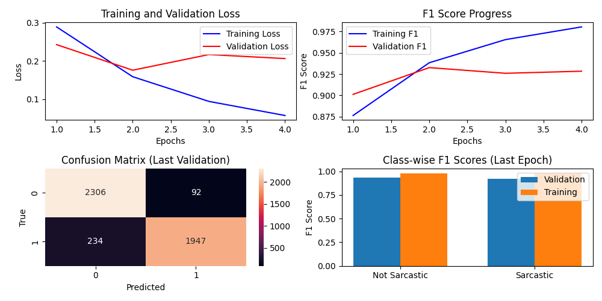

# Sarcasm Detection in Social Media

An NLP experiment comparing classical machine-learning, neural, and transformer-based approaches for binary sarcasm classification. The project uses the News Headlines Dataset, which contains headlines from *The Onion* and non-satirical news sources.

## Results

| Model | Test accuracy | Macro F1 |
| --- | ---: | ---: |
| BERT-BiLSTM | **93.0%** | **0.93** |
| CNN-BiLSTM with attention | 91.2% | 0.91 |
| TF-IDF with SVM / Logistic Regression | 87.5% | 0.87 |

The reported BERT-BiLSTM result comes from a stratified held-out test split. The repository includes training curves, model-comparison plots, and a test confusion matrix.



## What it demonstrates

- Reproducible text preprocessing and stratified train/validation/test splitting
- Transfer learning with contextual BERT representations
- Sequential modelling with a bidirectional LSTM
- CNN-BiLSTM architecture with attention and GloVe embeddings
- TF-IDF baselines using Linear SVM and Logistic Regression
- Optuna hyperparameter search, early stopping, and model checkpointing
- Evaluation with accuracy, precision, recall, macro-F1, classification reports, and confusion matrices

## Model design

### BERT-BiLSTM

The strongest model passes `bert-base-uncased` token representations to a bidirectional LSTM and a feed-forward classification head. BERT embeddings and the first six encoder layers are frozen in the final configuration.

### CNN-BiLSTM-Attention

The second neural model combines GloVe embeddings, convolutional n-gram features, bidirectional sequence modelling, and attention.

### Classical baselines

The baseline pipeline uses unigram and bigram TF-IDF features with grid-searched Logistic Regression and Linear SVM classifiers.

## Dataset and split

The project uses version 2 of the [News Headlines Dataset for Sarcasm Detection](https://github.com/rishabhmisra/News-Headlines-Dataset-For-Sarcasm-Detection), containing 26,709 labelled headlines.

For the BERT-BiLSTM experiment:

- Training: 64%
- Validation: 16%
- Test: 20%

All splits use a fixed random seed and preserve class proportions.

The dataset is not committed to this repository. Download `Sarcasm_Headlines_Dataset_v2.json` and place it at:

```text
data/raw/Sarcasm_Headlines_Dataset_v2.json
```

## Getting started

### Requirements

- Python 3.10 or 3.11
- A CUDA-capable GPU is recommended for transformer training

### Installation

```bash
git clone https://github.com/seidmengistu/Sarcastic-detection-in-social-media.git
cd Sarcastic-detection-in-social-media
python -m venv .venv
source .venv/bin/activate
pip install -r requirements.txt
python -m spacy download en_core_web_sm
mkdir -p data/raw data/processed checkpoints
```

On Windows, activate the environment with `.venv\Scripts\activate`.

### Preprocess the dataset

```bash
python utils/preprocess_news.py
```

### Train and evaluate

The main entry point discovers the available model modules and asks which one to run:

```bash
python main.py
```

Individual experiments can also be run directly:

```bash
python -m models.bert_lstm_model
python -m models.classical_methods
python -m models.Hybrid_Neural_Network
```

Run the Optuna search with:

```bash
python -m utils.model_tuner
```

## Best BERT-BiLSTM configuration

| Hyperparameter | Value |
| --- | ---: |
| Learning rate | 4.20e-5 |
| Batch size | 16 |
| LSTM hidden size | 256 |
| Intermediate size | 256 |
| Dropout | 0.269 |
| Weight decay | 0.0403 |
| Frozen BERT layers | 6 |

The configuration was selected from six Optuna trials using validation loss.

## Project layout

```text
models/
  bert_lstm_model.py         BERT-BiLSTM model and training loop
  Hybrid_Neural_Network.py  CNN-BiLSTM-Attention experiment
  classical_methods.py      TF-IDF baselines
utils/
  config.py                 Paths and hyperparameters
  dataset_loader.py         Stratified dataset splitting
  preprocess_news.py        Dataset conversion and normalization
  model_tuner.py            Optuna search
  evaluation_utils.py       Metrics and confusion matrices
main.py                     Experiment launcher
requirements.txt            Python dependencies
```

## Reproducibility and limitations

- Random seeds and split proportions are fixed in the data pipeline.
- Model weights and the source dataset are excluded because of their size and licensing considerations.
- The dataset source is correlated with the label: satirical and non-satirical headlines come from different publishers. Results therefore measure performance on this benchmark and may not generalize to conversational sarcasm.
- Reproducing the exact neural results can still vary slightly by hardware and library version.

## Author

[Seid Mengistu](https://github.com/seidmengistu)
